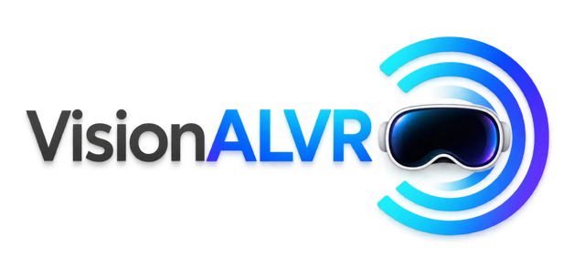

<p align="center">
  <picture>
    <source media="(prefers-color-scheme: dark)" srcset="docs/images/logo-dark.png">
    
  </picture>
</p>

# VisionALVR

Stream PC OpenXR games to **Apple Vision Pro** with the stock **ALVR** visionOS app, **without SteamVR**, on NVIDIA GPUs.

> [!WARNING]
> **ALPHA SOFTWARE (0.1): TEST AT YOUR OWN RISK.**
> On a real headset it has been tested by one person, on one PC (RTX 5090) with one Vision Pro (plus automated tests on a
> laptop GPU). Games may crash, fail to start, or show a broken image; the stream may stutter or have high latency. It changes your PC's OpenXR runtime registration and adds a firewall rule
> (both undone by `unregister_openxr_runtime.bat`). Keep comfort in mind: a frozen or juddering image in a headset can cause
> discomfort; take the headset off if anything looks wrong. Provided "as is", without warranty of any kind (see [LICENSE](LICENSE)).

**Target, and only target:** the **Windows** streamer on an **NVIDIA GeForce RTX 40 series or newer** GPU, with the
**ALVR app (20.14.x) on Apple Vision Pro**.

This is a **personal project**. It targets NVIDIA because that is what I run, and the Vision Pro because that is my headset.
It is not affiliated with or supported by NVIDIA, Apple or the ALVR project.
- **Other headsets**: the ALVR protocol is device agnostic, so other ALVR clients (Quest, Pico, ...) may well connect, but they
  are untested and not supported (encoder settings, defaults and the idle chroma-key frame are tuned for the Vision Pro).
- **AMD / Intel GPUs**: not supported and not planned. The encode path is NVENC only; you are welcome to fork and adapt it.
- Issues and pull requests for other headsets or GPU vendors will be closed. [ALVR](https://github.com/alvr-org/ALVR) itself
  supports them.

VisionALVR replaces the SteamVR + ALVR server pair on the PC with one lean streamer. It speaks the ALVR 20.14.1 protocol
unchanged, so the ALVR app on the headset sees an ordinary ALVR server. In between, it does less work:
no SteamVR compositor, no extra frame copies between processes, and an encode path written for NVENC only.

```
OpenXR game
  -> VirtualDesktop-OpenXR (VDXR, OpenXR runtime, small patches)
  -> OVRShim (LibOVRRT64_1.dll: composes layers into a shared 10-bit side-by-side frame ring)
  -> alvr_host.exe (ALVR v20.14.1 server_core + ALVR's own foveated encoding + NVENC HEVC 10-bit)
  -> ALVR protocol over Wi-Fi
  -> ALVR app on Vision Pro (stock, from the App Store)
```

## Status
- **Works on the real headset** (first pilot, RTX 5090 + Vision Pro): most UEVR games, Luke Ross mods (Dead Space Remake),
  controllers (ALVR's Quest/Touch emulation), haptics, game audio, discovery/pairing with the stock app.
- **Known issues**: one Unity game crashes, one UEVR game shows no image, one Unity game shows its menu very small.
  Fixed since the pilot but not yet re-tested on the headset: frame pacing (host display clock), head bobbing, image too dark,
  games running elevated (e.g. Cemu) never reaching the streamer.
- The benchmark that picks settings for your PC + router + headset is half built: the headless quality sweep works
  (`docs/BENCHMARK_DESIGN.md`); the headset phases and applying the results are next.
- Measured on a 1-NVENC laptop GPU and a 5090. Multi-engine split encode is wired in but not yet active in `auto` mode.

`docs/progress.md` is the detailed log: what is built, what is tested (and how), what is not.

## Requirements
- Windows 10/11, **NVIDIA GeForce RTX 40 series or newer** (the runtime refuses older GPUs).
- Apple Vision Pro with the **ALVR** app (20.14.x), PC and headset on the same LAN (5 GHz / 6 GHz Wi-Fi recommended).
- SteamVR and ALVR's own launcher closed while streaming (same ports).

## Install (users)
Download the release zip, unzip it anywhere, run `register_openxr_runtime.bat` once, then `configure.exe` (pair the headset,
benchmark, settings) and `VisionALVR.exe` (keep it open while you play). Details, settings and logs: [docs/INSTALL.md](docs/INSTALL.md).

## Build from source (contributors)
VisionALVR builds **on Windows only** (MSVC, the Windows SDK and NVENC; cross-compiling from Linux is not supported). With the
prerequisites installed ([docs/DEVELOPMENT.md](docs/DEVELOPMENT.md): Git, Rust, CMake, LLVM, NuGet, Visual Studio 2022 with C++,
all available through `winget`, plus an NVIDIA driver):
```powershell
git clone https://github.com/jfbobier/vision-alvr.git
cd vision-alvr
powershell -ExecutionPolicy Bypass -File build.ps1
```
The first run fetches ALVR v20.14.1 and VirtualDesktop-OpenXR at pinned commits and builds them (10+ minutes, ~6 GB); the
result is the same portable folder and zip as the release, in `out\dist\`. An automated test harness (end-to-end scenarios with
a headless mock ALVR client, no headset needed) is described in [harness/README.md](harness/README.md).
See also [CONTRIBUTING.md](CONTRIBUTING.md).

## Repository layout
| Path | What |
|---|---|
| `tools/host/` | `alvr_host` (Rust): ALVR server_core embedded, encoder loop, pacing, benchmarks, logging |
| `nvenc/hostlib/` | C++ library of the host: NVENC wrapper around ALVR's encoder, IPC, QP map, benchmark renderer + quality metric |
| `nvenc/upstream/` | ALVR's encoder sources, vendored **unmodified** (checksums in `nvenc/upstream.sha256`; patched at build time by `tools/host/build.rs`) |
| `ovrshim/` | OVRShim: the LibOVR-side driver loaded by VDXR (fork of VDXR's OVRNull): layer composition, frame ring, IPC |
| `tools/gui/` | `VisionALVR.exe` (runtime window) and `configure.exe` (pairing, benchmarks, settings), C# WinForms |
| `tools/install/` | portable-folder scripts (OpenXR runtime registration), shipped default session |
| `tools/mock_client/` | headless ALVR client (Rust, ALVR's client_core) used by the harness |
| `tools/probe/` | `xr_probe`: OpenXR test app (layers, input, pacing) |
| `tools/bench_scene/` | offline converter of the benchmark scene (glTF + Draco -> `.vab`) |
| `tools/patches/`, `tools/remote/` | the one ALVR patch (test-only loopback binding), PowerShell build/test stages run on the builder |
| `harness/` | test harness (Python, stdlib only): scenarios, checks, builder orchestration |
| `third_party/` | vendored headers (cgltf, stb_image) and licence texts |
| `docs/` | install guide, benchmark design, progress log |

## Relationship to upstream (how much is forked)
Nothing is a long-lived fork: ALVR and VirtualDesktop-OpenXR are fetched at pinned upstream commits (`deps.lock.json`) and
built with small, asserted patches, so an upstream change fails loudly instead of drifting.
| Upstream | How it is used | Changes |
|---|---|---|
| **ALVR v20.14.1** (Rust) | `server_core`, protocol, sockets, audio, session crates linked into `alvr_host` as a workspace member; client_core in the test client | one patch, 26 changed lines (`tools/patches/loopback-client.patch`): lets the test client bind its own loopback address; inactive unless `ALVR_BIND_IP` is set (it is compiled into `alvr_host.exe` through the shared `sockets` crate) |
| **ALVR encoder C++** (`VideoEncoderNVENC`, `NvEncoder*`, foveated encoding `FFR`, ~3,900 lines + NVIDIA's header) | vendored **unmodified** in `nvenc/upstream/` (checksums) | about 20 asserted build-time text replacements in `tools/host/build.rs`: 10-bit texture format, NVENC SDK 12.2 field names, a struct initializer the newer SDK broke, real error messages, split-frame encoding, QP delta map, reconstructed-frame output, accessors and a config dump |
| **VirtualDesktop-OpenXR** (the OpenXR runtime) | built from upstream at a pinned commit | 2 text patches + 1 define at build time (`tools/remote/stage15_vdxr.ps1`): per-eye visibility on quad/cylinder/cube layers in "Oculus runtime" mode, all 6 faces of cube swapchains, advertise the cube-layer extension |
| **VDXR's OVRNull** (sample "null" LibOVR driver) | `ovrshim/` = OVRShim, the one real fork | `driver.cpp` grew from 793 to ~1,850 lines (~1,190 new or changed), 6 new files (IPC, layer shaders); OVRNull's other ~1,570 lines are used unchanged |

Everything else is new code (~11,000 lines): the host (`tools/host`, Rust), the encoder library and benchmark
(`nvenc/hostlib`, C++), the GUIs, the installer scripts, the mock client, the OpenXR probe and the harness.

## Credits
VisionALVR stands on two projects that did the hard work:
- **[ALVR](https://github.com/alvr-org/ALVR)** (MIT) by polygraphene and the alvr-org contributors: the foundational
  infrastructure this is built on, its streaming protocol, server core, networking, audio, foveated encoding and NVENC
  encoder code, and the [ALVR visionOS client](https://github.com/alvr-org/alvr-visionos) that runs on the headset.
  VisionALVR exists because ALVR made wireless PC VR open.
- **[VirtualDesktop-OpenXR (VDXR)](https://github.com/mbucchia/VirtualDesktop-OpenXR)** (MIT) by Matthieu Bucchianeri and its
  contributors: the excellent, highly optimized OpenXR runtime every game here runs on; OVRShim started as its OVRNull sample.
  Thanks also for the many other OpenXR tools from the same author that the PC VR community relies on.
- NVIDIA Video Codec SDK header (MIT). cgltf (MIT), stb_image (public domain / MIT), Draco (Apache-2.0, offline converter only).
- Benchmark scene: "Littlest Tokyo" by Glen Fox ([glenatron](https://sketchfab.com/glenatron)), CC-BY-4.0, converted and placed
  in a textured room.

Details: [THIRD_PARTY_NOTICES.md](THIRD_PARTY_NOTICES.md). VisionALVR is not affiliated with or endorsed by the ALVR project,
Apple, NVIDIA or Virtual Desktop. Apple Vision Pro and visionOS are trademarks of Apple Inc.

## License
MIT, see [LICENSE](LICENSE). Third-party components keep their own licences ([THIRD_PARTY_NOTICES.md](THIRD_PARTY_NOTICES.md)).
